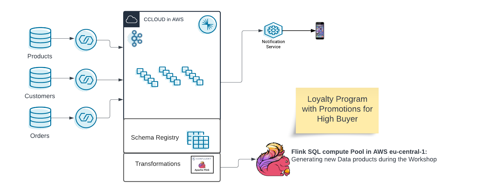

This is a fork of https://github.com/griga23/shoe-store 

- [Intro](#intro)
  - [Required Confluent Cloud Resources](#required-confluent-cloud-resources)
  - [Setup](#setup)
- [Workshop Labs](#workshop-labs)
  - [Lab1: Flink Tables, Select Statements, Aggregations, Time Windows](#lab1-flink-tables-select-statements-aggregations-time-windows)
    - [Open Shell](#open-shell)
    - [Flink Tables](#flink-tables)
    - [Aggregations](#aggregations)
    - [Time Windows](#time-windows)
    - [Tables with Primary Key](#tables-with-primary-key)
    - [Flink Jobs](#flink-jobs)
  - [Lab2: Join Statements, Data Enrichment, Statement Sets](#lab2-join-statements-data-enrichment-statement-sets)
    - [Data Enrichment](#data-enrichment)
    - [Loyalty Levels Calculation](#loyalty-levels-calculation)
    - [Promotions Calculation](#promotions-calculation)
- [Costs of this Confluent Cloud](#costs-of-this-confluent-cloud)
- [Destroy the hands.on infrastructure](#destroy-the-handson-infrastructure)


# Intro
Imagine you are running a shoe shop. You want to get an overview of shoe sales, understand your customers better, and you'd like to start a loyalty program, too. Luckily, you already use Confluent Cloud as a backbone for your data. This means you can leverage Confluent Flink SQL for some ad-hoc analyses, and determine which of your customers are currently eligible for a free pair of shoes!

For a good preparation and first understanding, please read this [Guide to Flink SQL: An In-Depth Exploration](https://www.confluent.io/blog/getting-started-with-apache-flink-sql/) . 
If you want a refresher of the Kafka basics, we highly recommend our [Kafka Fundamentals Workshop](https://www.confluent.io/resources/online-talk/fundamentals-workshop-apache-kafka-101/) .

In this demo, we will build a Shoe Store Loyalty Engine. We will use Flink SQL in Confluent Cloud on AWS (Azure or GCP also possible). You can find an architecture diagram below.



When demoing `Setup` section should be executed first since is what takes longer.

## Required Confluent Cloud Resources 

This is the deployment of confluent cloud infrastructure resources to run the Flink SQL Hands-on Workshop.
We will deploy with terraform:
 - Environment:
     - Name: flink_hands-on+UUID
     - with enabled Schema Registry (essentails) in AWS region (eu-central-1)
 - Confluent Cloud Basic Cloud: cc_handson_cluster
    - in AWS in region (eu-central-1)
 - Connectors:
    - Datagen for shoe_products
    - Datagen for shoe_customers 
    - Datagen for show_orders
 - Service Accounts
    - app_manager-XXXX with Role EnvironmentAdmin
    - sr-XXXX with Role EnvironmentAdmin
    - clients-XXXX with Role CloudClusterAdmin
    - connectors-XXXX
 


## Setup
- User account on [Confluent Cloud](https://www.confluent.io/confluent-cloud/tryfree)
- Local install of [Terraform](https://www.terraform.io) (details below)
- Local install of [jq](https://jqlang.github.io/jq/download) (details below)
- Local install Confluent CLI, [install the cli](https://docs.confluent.io/confluent-cli/current/install.html) 

```shell
echo "Enter a prefix value as 'rfernandes_':"
read prefix_value
confluent login
CC_API_KEY_SECRET=`confluent api-key create --resource cloud --description "API for terraform"`
CC_API_KEY=`echo "$CC_API_KEY_SECRET"| grep 'API Key'|sed s/'.*| '//g|sed s/' .*'//g`
CC_API_SECRET=`echo "$CC_API_KEY_SECRET"| grep 'API Secret'|sed s/'.*| '//g|sed s/' .*'//g`
cat > $PWD/terraform/terraform.tfvars <<EOF
confluent_cloud_api_key = "$CC_API_KEY"
confluent_cloud_api_secret = "$CC_API_SECRET"
use_prefix = "$prefix_value"
EOF
cd ./terraform
terraform init
terraform plan
terraform apply -auto-approve
cc_hands_env=`terraform output -json | jq -r .cc_hands_env.value`
cc_kafka_cluster=`terraform output -json | jq -r .cc_kafka_cluster.value`
cd ..
confluent environment use $cc_hands_env
CC_FLINK_COMP_POOL=`confluent flink compute-pool create my-compute-pool --cloud aws --region eu-central-1 --max-cfu 10`
cc_flink_pool=`echo "$CC_FLINK_COMP_POOL"| grep 'ID'|sed s/'.*| '//g|sed s/' .*'//g`
confluent flink compute-pool use $cc_flink_pool
```

Please check whether the terraform execution went without errors.
  
Wait for compute pool to be provisioned. You can check the status running:

```shell
confluent flink compute-pool describe
```

Once is Provisioned you can continue.

# Workshop Labs

## Lab1: Flink Tables, Select Statements, Aggregations, Time Windows

### Open Shell

To continue with the UI:
 - Access Confluent Cloud WebUI: https://confluent.cloud/login
 - Access your Environment: `<user_prefix>flink_handson_terraform-XXXXXXXX`

Else open a flink shell:

```shell
confluent flink shell
```

Execute:

```
SHOW CATALOGS;
```

And use your catalog:

```
USE CATALOG <MY CONFLUENT ENVIRONMENT NAME>;
```

Also:

```
SHOW DATABASES;
```

And use your database listed:

```
USE <YOUR CLUSTER NAME>;
```

### Flink Tables

Execute:

```
SHOW TABLES;
```

Check one:

```
SHOW CREATE TABLE shoe_products;
````

(Make sure you have enough roon in your shell window.)

And:

```
DESCRIBE shoe_products;
```

Check entries:

```
SELECT * FROM shoe_products;
````

We can also do:

```
DESCRIBE shoe_customers;
```

```
SELECT * FROM shoe_customers
  WHERE `state` = 'Texas' AND `last_name` LIKE 'B%';
```

```
DESCRIBE EXTENDED shoe_orders;
```

```
SELECT order_id, product_id, customer_id, $rowtime
  FROM shoe_orders
  WHERE customer_id = 'b523f7f3-0338-4f1f-a951-a387beeb8b6a'
  LIMIT 10;
```

### Aggregations

```
SELECT COUNT(id) AS num_customers FROM shoe_customers;
```

```
SELECT COUNT(DISTINCT id) AS num_customers FROM shoe_customers;
```

```
SELECT brand as brand_name, 
    COUNT(DISTINCT name) as models_by_brand, 
    ROUND(AVG(rating),2) as avg_rating,
    MAX(sale_price)/100 as max_price
FROM shoe_products
GROUP BY brand;
```

### Time Windows

```
SELECT
 window_end,
 COUNT(DISTINCT order_id) AS num_orders
FROM TABLE(
   TUMBLE(TABLE shoe_orders, DESCRIPTOR(`$rowtime`), INTERVAL '1' MINUTES))
GROUP BY window_end;
```

```
SELECT
 window_start, window_end,
 COUNT(DISTINCT order_id) AS num_orders
FROM TABLE(
   HOP(TABLE shoe_orders, DESCRIPTOR(`$rowtime`), INTERVAL '5' MINUTES, INTERVAL '10' MINUTES))
GROUP BY window_start, window_end;
```

### Tables with Primary Key

```
CREATE TABLE shoe_customers_keyed(
  customer_id STRING,
  first_name STRING,
  last_name STRING,
  email STRING,
  PRIMARY KEY (customer_id) NOT ENFORCED
  );
```

```
  SHOW CREATE TABLE shoe_customers_keyed;
```

We do have a different changelog.mode and a primary key constraint. What does this mean?

Create a new Flink job to copy customer data from the original table to the new table.

```
INSERT INTO shoe_customers_keyed
  SELECT id, first_name, last_name, email
    FROM shoe_customers;
```

```
SELECT COUNT(*) as AMOUNTROWS FROM shoe_customers_keyed;
```

```
SELECT * 
 FROM shoe_customers_keyed  
 WHERE customer_id = 'b523f7f3-0338-4f1f-a951-a387beeb8b6a';
```

 Compare with:

```
 SELECT *
 FROM shoe_customers
 WHERE id = 'b523f7f3-0338-4f1f-a951-a387beeb8b6a';
```

Create table with unique products and the job to populate:

```
CREATE TABLE shoe_products_keyed(
  product_id STRING,
  brand STRING,
  model STRING,
  sale_price INT,
  rating DOUBLE,
  PRIMARY KEY (product_id) NOT ENFORCED
  );
```

```
INSERT INTO shoe_products_keyed
  SELECT id, brand, `name`, sale_price, rating 
    FROM shoe_products;
```

### Flink Jobs

```shell
confluent flink statement list --cloud aws --region eu-central-1
```

How many are running?

```shell
confluent flink statement list --cloud aws --region eu-central-1 --status running
```

Check CFUs in use:

```shell
confluent flink compute-pool describe
```

## Lab2: Join Statements, Data Enrichment, Statement Sets

### Data Enrichment

```
CREATE TABLE shoe_order_customer_product(
  order_id INT,
  first_name STRING,
  last_name STRING,
  email STRING,
  brand STRING,
  model STRING,
  sale_price INT,
  rating DOUBLE
)WITH (
    'changelog.mode' = 'retract'
);
```

```
INSERT INTO shoe_order_customer_product(
  order_id,
  first_name,
  last_name,
  email,
  brand,
  model,
  sale_price,
  rating)
SELECT
  so.order_id,
  sc.first_name,
  sc.last_name,
  sc.email,
  sp.brand,
  sp.model,
  sp.sale_price,
  sp.rating
FROM 
  shoe_orders so
  INNER JOIN shoe_customers_keyed sc 
    ON so.customer_id = sc.customer_id
  INNER JOIN shoe_products_keyed sp
    ON so.product_id = sp.product_id;
```

### Loyalty Levels Calculation

```
SELECT
  email,
  SUM(sale_price) AS total,
  CASE
    WHEN SUM(sale_price) > 800000 THEN 'GOLD'
    WHEN SUM(sale_price) > 70000 THEN 'SILVER'
    WHEN SUM(sale_price) > 6000 THEN 'BRONZE'
    ELSE 'CLIMBING'
  END AS rewards_level
FROM shoe_order_customer_product
GROUP BY email;
```

```
CREATE TABLE shoe_loyalty_levels(
  email STRING,
  total BIGINT,
  rewards_level STRING,
  PRIMARY KEY (email) NOT ENFORCED
);
```

```
INSERT INTO shoe_loyalty_levels(
 email,
 total,
 rewards_level)
SELECT
  email,
  SUM(sale_price) AS total,
  CASE
    WHEN SUM(sale_price) > 80000000 THEN 'GOLD'
    WHEN SUM(sale_price) > 7000000 THEN 'SILVER'
    WHEN SUM(sale_price) > 600000 THEN 'BRONZE'
    ELSE 'CLIMBING'
  END AS rewards_level
FROM shoe_order_customer_product
GROUP BY email;
```

```
SELECT * FROM shoe_loyalty_levels;
```

### Promotions Calculation

Customer should receive a special promotion for their 10th order of the same shoe brand.

```
SELECT
   email,
   COUNT(*) AS total,
   (COUNT(*) % 10) AS sequence,
   (COUNT(*) % 10) = 0 AS next_one_free
 FROM shoe_order_customer_product
 WHERE brand = 'Jones-Stokes'
 GROUP BY email;
```

Customers have ordered related brands in large volumes.

```
SELECT
     email,
     COLLECT(brand) AS products,
     'bundle_offer' AS promotion_name
  FROM shoe_order_customer_product
  WHERE brand IN ('Braun-Bruen', 'Will Inc')
  GROUP BY email
  HAVING COUNT(DISTINCT brand) = 2 AND COUNT(brand) > 10;
```

```
  CREATE TABLE shoe_promotions(
  email STRING,
  promotion_name STRING,
  PRIMARY KEY (email) NOT ENFORCED
);
```

```
EXECUTE STATEMENT SET 
BEGIN

INSERT INTO shoe_promotions
SELECT
   email,
   'next_free' AS promotion_name
FROM shoe_order_customer_product
WHERE brand = 'Jones-Stokes'
GROUP BY email
HAVING COUNT(*) % 10 = 0;

INSERT INTO shoe_promotions
SELECT
     email,
     'bundle_offer' AS promotion_name
  FROM shoe_order_customer_product
  WHERE brand IN ('Braun-Bruen', 'Will Inc')
  GROUP BY email
  HAVING COUNT(DISTINCT brand) = 2 AND COUNT(brand) > 10;

END;
```

```
SELECT * from shoe_promotions;
```

How many flink jobs are running?

```shell
confluent flink statement list --cloud aws --region eu-central-1 --status running
```

Check CFUs in use:

```shell
confluent flink compute-pool describe
```

# Costs of this Confluent Cloud

The lab execution does not consume much money. We calculated an amount of less than 10$ for a couple of hours of testing. If you create the cluster one day before, we recommend to pause all connectors.

# Destroy the hands.on infrastructure

```bash
cd terraform
terraform destroy -auto-approve
cd ..
```

There could be a conflict destroying everything with our Tags. In this case destroy again via terraform.