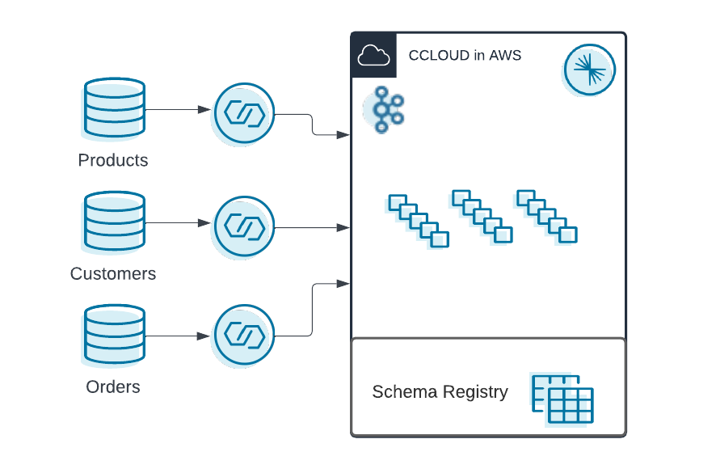

# Workshop Deployment via terraform

IMPORTANT TO KNOW FOR THE WORKSHOP:
We support following [cloud regions](https://docs.confluent.io/cloud/current/flink/index.html#af-long-is-everywhere) 

This is the deployment of confluent cloud infrastructure resources to run the Flink SQL Hands-on Workshop.
We will deploy with terraform:
 - Environment:
     - Name: flink_hands-on+UUID
     - with enabled Schema Registry (essentails) in AWS region (eu-central-1)
 - Confluent Cloud Basic Cloud: cc_handson_cluster
    - in AWS in region (eu-central-1)
 - Connectors:
    - Datagen for shoe_products
    - Datagen for shoe_customers 
    - Datagen for show_orders
 - Service Accounts
    - app_manager-XXXX with Role EnvironmentAdmin
    - sr-XXXX with Role EnvironmentAdmin
    - clients-XXXX with Role CloudClusterAdmin
    - connectors-XXXX
 


# Pre-requisites
- User account on [Confluent Cloud](https://www.confluent.io/confluent-cloud/tryfree)
- Local install of [Terraform](https://www.terraform.io) (details below)
- Local install of [jq](https://jqlang.github.io/jq/download) (details below)
- Local install Confluent CLI, [install the cli](https://docs.confluent.io/confluent-cli/current/install.html) 
- Create API Key in Confluent Cloud via CLI:

```bash
confluent login
export CC_API_KEY_SECRET=`confluent api-key create --resource cloud --description "API for terraform"`
export CC_API_KEY=`echo $CC_API_KEY_SECRET| grep 'API Key'|sed s/'.*| '//g|sed s/' .*'//g`
export CC_API_SECRET=`echo $CC_API_KEY_SECRET| grep 'API Secret'|sed s/'.*| '//g|sed s/' .*'//g`
```


## Set environment variables
- Add your API key to the Terraform variables by creating a tfvars file
```bash
cat > $PWD/terraform/terraform.tfvars <<EOF
confluent_cloud_api_key = "$CC_API_KEY"
confluent_cloud_api_secret = "$CC_API_SECRET"
EOF
```

### Optional: Prefix your resources

In some cases you may want to prefix your resources, to do so use:

```bash
cat >> $PWD/terraform/terraform.tfvars <<EOF
use_prefix = "{choose your prefix}"
EOF
```

## Deploy via terraform
run the following commands:
```Bash
cd ./terraform
terraform init
terraform plan
terraform apply
# Apply shows you what will be provision, enter yes to continue provisioning 
terraform output -json
# for sensitive data
terraform output -raw SRSecret
terraform output -raw AppManagerSecret
terraform output -raw ClientSecret
```

Please check whether the terraform execution went without errors.

You can copy the login instruction also from the UI.

To continue with the UI:
 - Access Confluent Cloud WebUI: https://confluent.cloud/login
 - Access your Environment: `flink_handson_terraform-XXXXXXXX`
 - Start with [lab1](../lab1.md)

You deployed:


You are ready to [start with LAB1](../lab1.md)

# Destroy the hands.on infrastructure
```bash
terraform destroy
```
There could be a conflict destroying everything with our Tags. In this case destroy again via terraform.
```bash
#╷
#│ Error: error deleting Tag "<tagID>/PII": 409 Conflict
#│ 
#│ 
#╵
#╷
#│ Error: error deleting Tag "<tagID>/Public": 409 Conflict
#│ 
#│ 
#╵
# destroy again
terraform destroy
``` 
